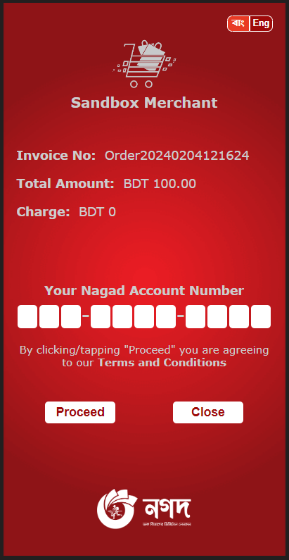

# Nagad Sandbox Payment Gateway Integration Guide

## # Credentials to be provided by Nagad

```
$MerchantID = "Specific Merchant id"
$merchantPrivateKey = "Merchant Private Key"
$pgPublicKey = "Nagad Payment Gateway public Key"
```


## #  Payment Initialization

## * Initialize API Request

### 1. Initialize API:

`http://sandbox.mynagad.com:10080/remote-payment-gateway-1.0/api/dfs/checkout/initialize/{merchantId}/{orderId}`

### 2. Initialize API Header:
  

```
Content-Type: application/json
X-KM-Api-Version: v-0.2.0
X-KM-IP-V4: 192.168.0.1
X-KM-MC-Id: 683002007104225
X-KM-Client-Type: PC_WEB
```
### 3. Initialize API Body:

#### Step 1 : Create a json like below format -
```json
plainSensitiveData = 
{
    "merchantId":"683002007104225",
    "orderId":"Order20240202124953",
    "datetime":"20240202124953",
    "challenge":348027480 //random generated number
}
```

#### Step 2: Encrypt the plainSensitiveData
sensitiveData = Encrypt(plainSensitiveData, NPG Public Key, PKCS1Padding)

```
sensitiveData = "PMxT0xqUBzUrrTmoW1bkxDfcWN6lnw8l2gnCqGPL8OZ0/MLMDBS1bFXwwG+o305XLCGohgSnhSFPA8xD0xGzQXllbgbTbbQWRyLdldJPdpvyvtbjSEkPEoCtShPvpo7oqubX105SgJ7cvxex6k8QqyJ9YSPGCjYQF1CQmJyo3ChqMO/JoWtSyc1KQKs8knKP1uzJttKF30rNzHAP1BD9AvYoda72S1WJEAMbTc34KGyy2f462m8zsTBxFYnPFqpVOBf2BQOT2QCOPly8W39/UfEhq/RqDhvxDSubmpL8YisrxHeKnEo3Br4aweouEdBx4l276AfcAx0DtfHttBtQ/Q=="
```

#### Step 3: Generate signature
signature = Sign(plainSensitiveData, Merchant Private Key,
SHA1withRSA)

```
signature = "B6QMGIFREuXwqZ/1D91rqIxMf5lCKcqwA5TATzTv5Z2OYN8e7Ex2uldjAX3N647qN2IqPUAGOV+722qGYZjfW7LWJdA6pY0buQwoZdfHqZX3zt57mXMNdEJNoBHVqEqXGXXB5Ke+U1r0kBxrocImiykHiLbAmJxvO3CR1EsFnLUhldwzRPw9WU/DL1sCh6g02mcy/z4X09CtMQbmbVdkfm3Vn3Rdy8lcPWz1tQkq/hkdMe2t/w+p6dc2hEO6wSsWwyoYOWS9X4pOYwR0ZPJfU/U+9FAcRevHoe2WdzmE7fbGjLoqs3MOgNkaWAzXxHqsw8pksGCzbVw7xUeuJxOtsw=="
```

#### Step 4: Send post Request to the Initialize API with those header and post body {datetime, sensitiveData, signature}. 

#### Equivalent curl: 

```bash
curl -X POST http://sandbox.mynagad.com:10080/remote-payment-gateway-1.0/api/dfs/check-out/initialize/683002007104225/Order20240202124953 \
  -H "X-KM-IP-V4: 192.168.0.1" \
  -H "X-KM-MC-Id: 683002007104225" \
  -H "X-KM-Client-Type: PC_WEB" \
  -H "X-KM-Api-Version: v-0.2.0" \
  -d '{
    "datetime": "20240202124953",
    "sensitiveData": "PMxT0xqUBzUrrTmoW1bkxDfcWN6lnw8l2gnCqGPL8OZ0/MLMDBS1bFXwwG+o305XLCGohgSnhSFPA8xD0xGzQXllbgbTbbQWRyLdldJPdpvyvtbjSEkPEoCtShPvpo7oqubX105SgJ7cvxex6k8QqyJ9YSPGCjYQF1CQmJyo3ChqMO/JoWtSyc1KQKs8knKP1uzJttKF30rNzHAP1BD9AvYoda72S1WJEAMbTc34KGyy2f462m8zsTBxFYnPFqpVOBf2BQOT2QCOPly8W39/UfEhq/RqDhvxDSubmpL8YisrxHeKnEo3Br4aweouEdBx4l276AfcAx0DtfHttBtQ/Q==",
    "signature": "B6QMGIFREuXwqZ/1D91rqIxMf5lCKcqwA5TATzTv5Z2OYN8e7Ex2uldjAX3N647qN2IqPUAGOV+722qGYZjfW7LWJdA6pY0buQwoZdfHqZX3zt57mXMNdEJNoBHVqEqXGXXB5Ke+U1r0kBxrocImiykHiLbAmJxvO3CR1EsFnLUhldwzRPw9WU/DL1sCh6g02mcy/z4X09CtMQbmbVdkfm3Vn3Rdy8lcPWz1tQkq/hkdMe2t/w+p6dc2hEO6wSsWwyoYOWS9X4pOYwR0ZPJfU/U+9FAcRevHoe2WdzmE7fbGjLoqs3MOgNkaWAzXxHqsw8pksGCzbVw7xUeuJxOtsw=="
  }'

```

## * Initialize API Response

### 1. Get Response
```json
InitializeResponse = 
{
  "sensitiveData": "DKEmjgIU5QODnqw1N6yRb1KCo11+4Be83ZW7bQJX3zAodO4ABn4WRFkvjsz11tYwCmx1vpFmTSgKfWEY7APVYmxoB9zT+M4QRQ1H3DGvTxr7w/EJxK4HDV4UfUTlp5lCHh/lkBaVrNDWsEKa0Qp8Kxj6TlNQ1X8UFE2T/QU8wY63XTHmWCj2bhfGGrW+5WUzpJ1ofszee3QC+WRj8/BUT+j1AbTSqv2/frLg16gh/QJYxIxHdvNu0zV7ai4KO+oCuFZXMebvwGXNac5GHlfa3OZRwihG1gphdeeF1yhphGK6uo/t7DgcUwWDJq5RMkMe7fIU59ce8KTVFxiqBoosQw==",
  "signature": "UmMg7n3g+6NGPLYbELnOoI93kZ0ux6C0xP98rM3KOBSBS75GkcMhIGSDqaX5V+wmuk6SvcRAa1+250rnpO9oaZsOkPuk5hO+gQEe7gHNUrcK2d5XwJSr6VTkRv/fJJiAzPtNNmgC1aHFPj2J+jEGDiL/38aNu9CatrC3rG3urscXwPlafp77bdnDX344cFw2CmhHOQ1jnFKxWVZvIgAYu10rwnGIUU/7SgDgCper7KSd3v9/Smlrm3aOJT6sjAcjnfMg1F+3tdoCQfXbK5am/MOCx8vGUfRk/BoOz9uxaHCC9Z32+spAhj0rRie2GaEPQjvaJkWpQwKvLA+6vC7YHA=="
}
```
### 2. Decode data from response
```
decodedSensitiveData = Base64_Decode(sensitiveData)
decodedsignature = Base64_Decode(signature)
decryptedSensitiveData = Decrypt(decodedSensitiveData, MS Private Key, PKCS1Padding)
```

```json
decryptedSensitiveData = 
{
  "paymentReferenceId": "MDIwMjEyNTQ0NTAzMy42ODMwMDIwMDcxMDQyMjUuT3JkZXIyMDI0MDIwMjEyNDk1My5jYjEwOWM2NTgyYzU2ZjMzZjc0Zg==",
  "challenge": "cb109c6582c56f33f74f",
  "acceptDateTime": "20240202125445"
}
```

### 3. Signature Verification
```
verification = Verify(decryptedSensitiveData, decodedsignature, NPG Public Key, SHA1withRSA)
```

## #  Payment Complete:

## * Checkout Complete API Request
### 1. Checkout Complete API

`http://sandbox.mynagad.com:10080/remote-payment-gateway-1.0/api/dfs/check-out/complete/{PaymentReferenceId_From_decryptedSensitiveData}`

### 2. Checkout Complete API Header
 Same as Initialize API Header

### 3. Checkout Complete API Body
  
#### Step 1 : Create a json like below format -
```json
plainSensitiveData = 
{
  "merchantId":"683002007104225",
  "orderId":"Order20240202124953",
  "currencyCode":"050",
  "amount":"100",
  "challenge":"cb109c6582c56f33f74f" //provided from initialize api response
}
```
#### Step 2: Encrypt the plainSensitiveData
sensitiveData = Encrypt(plainSensitiveData, NPG
Public Key, PKCS1Padding)

```
sensitiveData = "LCTqbe3kvVotumG93skO6+iPhzkK0cr38ZnyZCcls93gx2bIiriiIA9S9T3Kf5Q6sbxTi2tx0Kx5BI16dARxQw52sOnlHLiGOHL9Sc1SPpj7WMSrFfL/N5kk9MJQ2iUxSUpRceNDKc/PniuoVro+Jpey3Y+Y0Wx1TwolkmAuSjaONMJf+WVmtoUvS7LFwkm4Mbu74PMsrxM+i80yMmumcuCNKerTp4UhZ9hXwD2sbRGevfmcavjDwShlK4+IatZLNQe9uxn9MZ6RfFH3M0vEqcYywd/qfKye0OLE3PlslOZRK2JALWJDdr4ItvllBfIzSMTmnQ97hT2/uLKQk2jSTA=="
```

#### Step 3: Generate signature
 signature = Sign(plainSensitiveData, Merchant Private Key,
SHA1withRSA)

```
signature = "DZz8IslvhHkEpesk4BQLaQdZ32fGv+HrULA7HLixku/uLlk3wx3xrDhKZ5142nHziX4I9G4fGF7sS8qGwl9I85GkVIS4bznBHhcP2wCifK5wT4pJ5HX1rn0veA+7OrZ89Y/61kMk+wFeX0s/88HbZwusE1zbMOPG8AwtG7UDX1QOyxXfH9ucNLQEFZ9S1ouR9WDsiWZN+GLep5oYLFiLDjOoSR4QSdNTTtJaJXz/ymr8JW3bXKmUlTPNiGY7ko/R/i55V5T0/HULXdtw2vDRkDslwfsfBKOAO2uDiL88NxzADdoZFtAWBeI9XNZOnKdAhKjI1NKXFrzbEsxQncqDTQ=="
```

#### Step 4: Send post Request to the Initialize API with those header and post_body = {sensitiveData, signature, merchantCallbackURL, additionalMerchantInfo}. 

#### Equivalent curl: 
```bash
curl -X POST http://sandbox.mynagad.com:10080/remote-payment-gateway-1.0/api/dfs/check-out/complete/MDIwMjEyNTQ0NTAzMy42ODMwMDIwMDcxMDQyMjUuT3JkZXIyMDI0MDIwMjEyNDk1My5jYjEwOWM2NTgyYzU2ZjMzZjc0Zg== \
  -H "X-KM-IP-V4: 192.168.0.1" \
  -H "X-KM-MC-Id: 683002007104225" \
  -H "X-KM-Client-Type: PC_WEB" \
  -H "X-KM-Api-Version: v-0.2.0" \
  -d '{
  "sensitiveData": "LCTqbe3kvVotumG93skO6+iPhzkK0cr38ZnyZCcls93gx2bIiriiIA9S9T3Kf5Q6sbxTi2tx0Kx5BI16dARxQw52sOnlHLiGOHL9Sc1SPpj7WMSrFfL/N5kk9MJQ2iUxSUpRceNDKc/PniuoVro+Jpey3Y+Y0Wx1TwolkmAuSjaONMJf+WVmtoUvS7LFwkm4Mbu74PMsrxM+i80yMmumcuCNKerTp4UhZ9hXwD2sbRGevfmcavjDwShlK4+IatZLNQe9uxn9MZ6RfFH3M0vEqcYywd/qfKye0OLE3PlslOZRK2JALWJDdr4ItvllBfIzSMTmnQ97hT2/uLKQk2jSTA==",
  "signature": "DZz8IslvhHkEpesk4BQLaQdZ32fGv+HrULA7HLixku/uLlk3wx3xrDhKZ5142nHziX4I9G4fGF7sS8qGwl9I85GkVIS4bznBHhcP2wCifK5wT4pJ5HX1rn0veA+7OrZ89Y/61kMk+wFeX0s/88HbZwusE1zbMOPG8AwtG7UDX1QOyxXfH9ucNLQEFZ9S1ouR9WDsiWZN+GLep5oYLFiLDjOoSR4QSdNTTtJaJXz/ymr8JW3bXKmUlTPNiGY7ko/R/i55V5T0/HULXdtw2vDRkDslwfsfBKOAO2uDiL88NxzADdoZFtAWBeI9XNZOnKdAhKjI1NKXFrzbEsxQncqDTQ==",
  "merchantCallbackURL": "http://sandbox.mynagad.com:10707/merchant-server/web/confirm",
  "additionalMerchantInfo": {
    "productName": "shirt",
    "productCount": 1
  }
}'
```

## * Checkout Complete API Response

### 1. Get Reponse
```json
Response = 
{
  "callBackUrl":"https://sandbox-ssl.mynagad.com:10061/check-out/MDIwMjEyNTQ0NTAzMy42ODMwMDIwMDcxMDQyMjUuT3JkZXIyMDI0MDIwMjEyNDk1My5jYjEwOWM2NTgyYzU2ZjMzZjc0Zg==",
  "status":"Success"
}
```
### 2. CallBackUrl
The callBackUrl will display the payment gateway page as below




